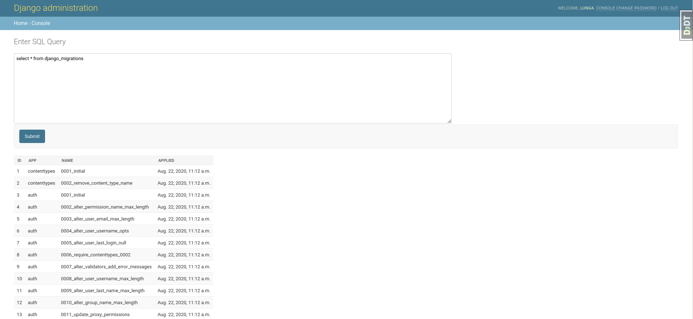

# Django SQL Console

Sqlconsole is a django app that allows for the execution of sql queries from the admin section of a django site.

Sqlconsole only works with the current LTS version of django (2.2).

## Install

```
pip install django-sqlconsole
```

Add the app to ```INSTALLED_APPS```

```
INSTALLED_APPS = [
...
'sqlconsole'
]
```
Add the console url to the projects base ```urls.py``` file

```
urlpatterns = [
...,
path(
        "admin/console/",
        include(("sqlconsole.urls", "sqlconsole"), namespace="console"),
    ),
]

```


Go the url ```localhost:8000/admin/console``` to start entering queries.

## Screenshot

